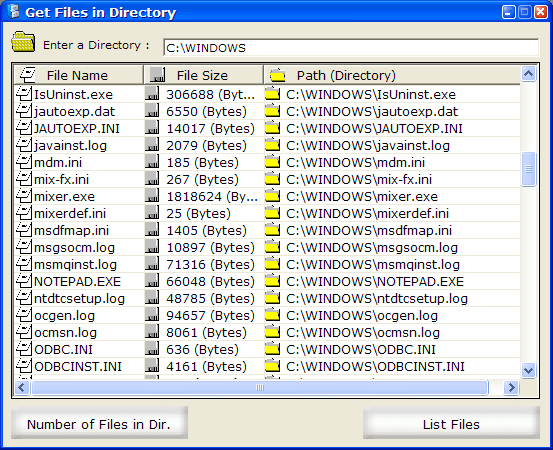



## Get Files In A Directory

### Description

This gets a list of files in a directory using the Dir$() function and displays them in a ListView control with their FileName, FileSize, and Path. Comments are always appreciated...:)
 
### More Info
 

             |
---                |---
**Submitted On**   |2003-04-19 04:56:16
**By**             |[Daniel W\. Elkins](https://github.com/Planet-Source-Code/PSCIndex/blob/master/ByAuthor/daniel-w-elkins.md)
**Level**          |Beginner
**User Rating**    |4.7 (14 globes from 3 users)
**Compatibility**  |VB 3\.0, VB 4\.0 \(16\-bit\), VB 4\.0 \(32\-bit\), VB 5\.0, VB 6\.0, VB Script, ASP \(Active Server Pages\) , VBA MS Access, VBA MS Excel
**Category**       |[Complete Applications](https://github.com/Planet-Source-Code/PSCIndex/blob/master/ByCategory/complete-applications__1-27.md)
**World**          |[Visual Basic](https://github.com/Planet-Source-Code/PSCIndex/blob/master/ByWorld/visual-basic.md)
**Archive File**   |[Get\_Files\_1576204192003\.zip](https://github.com/Planet-Source-Code/daniel-w-elkins-get-files-in-a-directory__1-44855/archive/master.zip)

